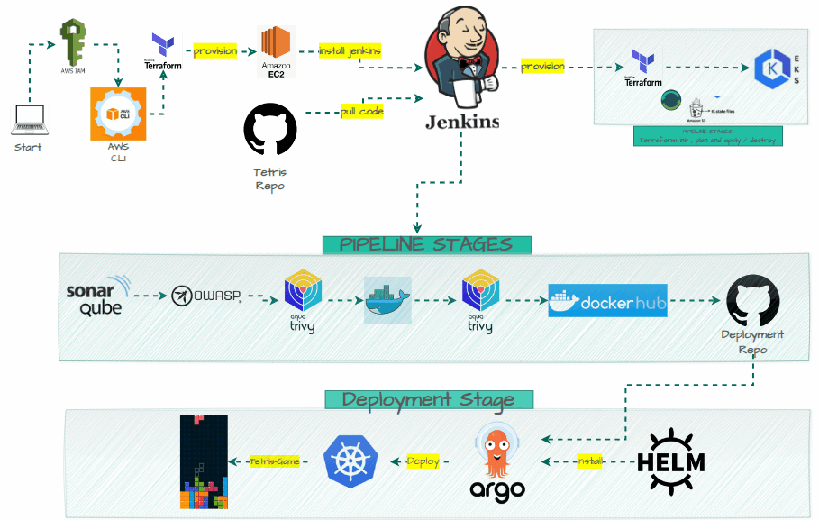

# Tetris Game Deployment 
  

  ### This project aims to automate the deployment of a Tetris game application using a CI/CD pipeline with Jenkins, Docker, Amazon EC2, ECR, EKS, SonarQube, OWASP Dependency-Check, Trivy, and ArgoCD. 
  
  # Prerequisites  
  #### 1. AWS CLI: Installed and configured on the local machine.
  #### 2. Terraform: Installed on the local machine.
  #### 3. Jenkins: Installed and running on an EC2 instance.
  #### 4. Docker: Installed on the Jenkins server.
  #### 5. SonarQube: Integrated with Jenkins for code analysis.
  #### 6. OWASP Dependency-Check: Integrated with Jenkins for security vulnerability scanning.
  #### 7. Trivy: Integrated with Jenkins for container image scanning.
  #### 8. ArgoCD: Installed in the EKS cluster for continuous deployment.
  
# Workflow Steps
#### 1. AWS IAM Setup
  * Configure AWS IAM roles and policies for provisioning resources and accessing services.

#### 2. Terraform for Infrastructure Provisioning
* **EC2 Instance Provisioning**: Use Terraform to provision an EC2 instance where Jenkins will be installed.
* **EKS Cluster Provisioning**: Use Terraform to provision an EKS cluster for deploying the Tetris game application.

#### 3. Jenkins Setup
* **Install Jenkins**: On the provisioned EC2 instance.
* **Configure Jenkins**: Set up required plugins and credentials.

#### 4. Code Repository
* **Tetris Repo:** Host the application code in a repository (e.g., GitHub).

* **Pull Code**: Jenkins pulls the latest code from the Tetris repository.

#### 5. CI/CD Pipeline Stages in Jenkins
* **SonarQube Analysis**: Analyze the code for quality and security issues.
* **OWASP Dependency-Check**: Scan the project dependencies for known vulnerabilities.
* **Trivy FS Scan**: Scan the filesystem for vulnerabilities.
* **Docker Build and Push**:
   * Build Docker images for the application.
   * Tag the images and push them to Docker Hub.
* **Trivy Image Scan**: Scan the Docker images for vulnerabilities.
* Deployment Repo Update: Update the deployment repository with the new image tags.

#### 6. Deployment Stage
* **ArgoCD Installation**: Install ArgoCD in the EKS cluster using Helm.
* **Deploy Application**: Deploy the Tetris game application using ArgoCD.

# Detailed Steps
#### AWS CLI Configuration
1. Install AWS CLI on your local machine.
2. Configure AWS CLI with your credentials:

```bash
  aws configure
```


#### Terraform for EC2 and EKS Provisioning
**1. EC2 Instance**:

* Create a Terraform script to provision an EC2 instance.
* Example main.tf:

```bash
# AWS plugin  
provider "aws" {
  region = "eu-north-1"
}


resource "aws_instance" "jenkins_instance" {
  ami                         = "ami-07c8c1b18ca66bb07"                 # "ami-080e1f13689e07408"
  instance_type               = "t3.medium"
  #subnet_id                   = aws_subnet.public_subnet_01.id
  key_name                    = "keypair"  
  associate_public_ip_address = true
  root_block_device {
    volume_size = 30
  }
 # Read the local install_jenkins.sh script and set it as user data
  user_data = file("jenkins.sh")

  tags = {
    Name = "jenkins_instance"

  }
  security_groups = [aws_security_group.jenkins_instance_sg.id]

}

resource "local_file" "public_ip_file" {
  filename = "jenkins_IP"
  content  = aws_instance.jenkins_instance.public_ip
}


resource "aws_security_group" "jenkins_instance_sg" {
  name        = "jenkins_instance_sg"
  description = "security group for jenkins instance"
  vpc_id      = aws_vpc.node_vpc.id


  # Define ingress rules
  ingress {
    from_port   = 0
    to_port     = 0
    protocol    = "-1"
    cidr_blocks = ["0.0.0.0/0"]

  }


  # Define egress rules
  egress {
    from_port   = 0
    to_port     = 0
    protocol    = "-1"
    cidr_blocks = ["0.0.0.0/0"]
  }
}

#tls
#key-pair
#tls-private-key to add in locall
#in userdata of bastion echo command add the file of private key in bastion file

resource "tls_private_key" "keys" {
  algorithm   = "RSA"
  rsa_bits    = 2048
}

resource "aws_key_pair" "keypair" {
  key_name   = "keypair"
  public_key = tls_private_key.keys.public_key_openssh
}

resource "local_file" "private_key" {
  filename = "./private_key.pem"
  content  = tls_private_key.keys.private_key_pem
}

```

* **bash script file**

```bash
#!/bin/bash
sudo apt update -y
wget -O - https://packages.adoptium.net/artifactory/api/gpg/key/public | tee /etc/apt/keyrings/adoptium.asc
echo "deb [signed-by=/etc/apt/keyrings/adoptium.asc] https://packages.adoptium.net/artifactory/deb $(awk -F= '/^VERSION_CODENAME/{print$2}' /etc/os-release) main" | tee /etc/apt/sources.list.d/adoptium.list
sudo apt update -y
sudo apt install temurin-17-jdk -y
/usr/bin/java --version
curl -fsSL https://pkg.jenkins.io/debian-stable/jenkins.io-2023.key | sudo tee /usr/share/keyrings/jenkins-keyring.asc > /dev/null
echo deb [signed-by=/usr/share/keyrings/jenkins-keyring.asc] https://pkg.jenkins.io/debian-stable binary/ | sudo tee /etc/apt/sources.list.d/jenkins.list > /dev/null
sudo apt-get update -y
sudo apt-get install jenkins -y
sudo systemctl start jenkins
sudo systemctl status jenkins

#install docker
sudo apt-get update
sudo apt-get install docker.io -y
sudo usermod -aG docker ubuntu  
sudo usermod -aG docker jenkins
newgrp docker
sudo chmod 777 /var/run/docker.sock
docker run -d --name sonar -p 9000:9000 sonarqube:lts-community

# install trivy
sudo apt-get install wget apt-transport-https gnupg lsb-release -y
wget -qO - https://aquasecurity.github.io/trivy-repo/deb/public.key | gpg --dearmor | sudo tee /usr/share/keyrings/trivy.gpg > /dev/null
echo "deb [signed-by=/usr/share/keyrings/trivy.gpg] https://aquasecurity.github.io/trivy-repo/deb $(lsb_release -sc) main" | sudo tee -a /etc/apt/sources.list.d/trivy.list
sudo apt-get update
sudo apt-get install trivy -y

#install terraform
sudo apt install wget -y
wget -O- https://apt.releases.hashicorp.com/gpg | sudo gpg --dearmor -o /usr/share/keyrings/hashicorp-archive-keyring.gpg
echo "deb [signed-by=/usr/share/keyrings/hashicorp-archive-keyring.gpg] https://apt.releases.hashicorp.com $(lsb_release -cs) main" | sudo tee /etc/apt/sources.list.d/hashicorp.list
sudo apt update && sudo apt install terraform

#install Kubectl on Jenkins
sudo apt update
sudo apt install curl -y
curl -LO https://dl.k8s.io/release/$(curl -L -s https://dl.k8s.io/release/stable.txt)/bin/linux/amd64/kubectl
sudo install -o root -g root -m 0755 kubectl /usr/local/bin/kubectl
kubectl version --client

#install Aws cli 
curl "https://awscli.amazonaws.com/awscli-exe-linux-x86_64.zip" -o "awscliv2.zip"
sudo apt-get install unzip -y
unzip awscliv2.zip
sudo ./aws/install

```

* **Initialize and apply the Terraform script**:

```bash
terraform init
terraform apply
```

**2. EKS Cluster using Jenkins**:
* **EKS-Code**: you can see files from Jenkins-eks directroy
* **EKS-Jenkins**:

```bash
pipeline {
    agent any

    parameters {
        choice(name: 'Action', choices: ['apply', 'destroy'], description: 'Select Terraform action')
    }

    environment {
        TERRAFORM_DIR = 'jenkins-eks'
        AWS_ACCESS_KEY_ID = credentials('aws-access-key')
        AWS_SECRET_ACCESS_KEY = credentials('aws-secret-key')
    }

    stages {
        stage('Checkout from Git') {
            steps {
                git branch: 'main', url: 'my-repo-url'
            }
        }

        stage('Terraform init') {
            steps {
                dir(TERRAFORM_DIR) {
                    sh 'terraform init'
                }
            }
        }

        stage('Terraform plan') {
            steps {
                dir(TERRAFORM_DIR) {
                    sh 'terraform plan'
                }
            }
        }

        stage('Terraform apply/destroy') {
            steps {
                dir(TERRAFORM_DIR) {
                    sh "terraform ${params.Action} --auto-approve"
                }
            }
        }
    }
}
```

#### Jenkins Setup and Configuration
1. Install Jenkins: Follow the official Jenkins documentation to install Jenkins on the EC2 instance.
2. Configure Plugins:
    * Install required plugins: Docker, Kubernetes, SonarQube, OWASP Dependency-Check, Trivy.
3. Configure Credentials:
    * Add Docker Hub credentials.
    * Add AWS credentials.
#### **Jenkins Pipeline Configuration**
**1. Pipeline Script**:
  * Create a Jenkins pipeline script (Jenkinsfile) with the following stages:


```bash
pipeline {
    agent any
    tools {
        jdk 'jdk17'
        nodejs 'node16'
    }
    environment {
        SCANNER_HOME = tool 'sonar-scanner'
        GIT_REPO_NAME = "tetris-deployment-file" 
        GIT_USER_NAME = "MohamedMagdy840"
        GIT_REPO_URL  = "https://github.com/MohamedMagdy840/tetris-deployment-file.git"
    }

    stages {
        stage('Clean Workspace') {
            steps {
                cleanWs()
            }
        }

        stage('SonarQube Analysis') {
            steps {
                withSonarQubeEnv('sonar-server') {
                    sh '''$SCANNER_HOME/bin/sonar-scanner -Dsonar.projectName=tetris \
                    -Dsonar.projectKey=tetris'''
                }
            }
        }

        stage('Quality Gate') {
            steps {
                script {
                    waitForQualityGate abortPipeline: false, credentialsId: 'sonar-token'
                }
            }
        }

        stage('Install Dependencies') {
            steps {
                sh "npm install"
            }
        }

        stage('OWASP FS Scan') {
            steps {
                dependencyCheck additionalArguments: '--scan ./ --disableYarnAudit --disableNodeAudit', odcInstallation: 'DP-Check'
                dependencyCheckPublisher pattern: '**/dependency-check-report.xml'
            }
        }

        stage('Trivy FS Scan') {
            steps {
                sh "trivy fs . > trivyfs.txt"
            }
        }

        stage('Docker Operations') {
            steps {
                script {
                    // Login to Docker Hub
                    withCredentials([usernamePassword(credentialsId: 'docker', usernameVariable: 'DOCKER_USER', passwordVariable: 'DOCKER_PASS')]) {
                        sh """
                            echo "$DOCKER_PASS" | docker login -u "$DOCKER_USER" --password-stdin
                        """
                    }

                    // Build Docker image
                    sh """
                        docker build -t tetris .
                    """

                    // Tag Docker image with a new tag
                    sh """
                        docker tag tetris mohamedmagdy840/tetris:latest
                    """

                    // Push Docker image to Docker Hub
                    sh """
                        docker push mohamedmagdy840/tetris:latest
                    """
                }
            }
        }

        stage('Trivy Image Scan') {
            steps {
                sh "trivy image mohamedmagdy840/tetris:latest > trivyimage.txt"
            }
        }

    stages {
        stage('Update Deployment File') {
            steps {
                script {
                    withCredentials([usernamePassword(credentialsId: 'git-credentials-id', usernameVariable: 'GIT_USERNAME', passwordVariable: 'GITHUB_TOKEN')]) {
                        sh "sed -i 's|image: .*|image: mohamedmagdy840/tetris:latest|' deployment-service.yaml"
                        sh 'git add deployment-service.yaml'
                        sh "git commit -m 'Update deployment image to mohamedmagdy840/tetris:latest'"
                        sh "git push https://${GIT_USERNAME}:${GITHUB_TOKEN}@${GIT_REPO_URL} HEAD:main"
                    }
                }
            }
        }
    }

```
#### Deployment-Service file

```bash
---
apiVersion: apps/v1
kind: Deployment
metadata:
  name: tetris
spec:
  selector:
    matchLabels:
      app: tetris
  template:
    metadata:
      labels:
        app: tetris
    spec:
      containers:
      - name: app-tetris
        image: tetris-image
        ports:
        - containerPort: 3000
---
apiVersion: v1
kind: Service
metadata:
  name: tetris
spec:
  type: LoadBalancer 
  selector:
    app: tetris
  ports:
  - port: 80  # Example port number for external access
    targetPort: 3000  # Assuming your application runs on port 3000 inside the container
```

#### Deployment with ArgoCD

**1. Install ArgoCD**:

* Use Helm to install ArgoCD in the EKS cluster.
* Example commands:

```bash
helm repo add argo https://argoproj.github.io/argo-helm
helm install argo-cd argo/argo-cd --namespace argocd --create-namespace
```

#### Expose argocd-server
By default argocd-server is not publicaly exposed. For the purpose of this workshop, we will use a Load Balancer to make it usable:

```bash
kubectl patch svc argocd-server -n argocd -p '{"spec": {"type": "LoadBalancer"}}'
snap install jq
export ARGOCD_SERVER=`kubectl get svc argocd-server -n argocd -o json | jq --raw-output '.status.loadBalancer.ingress[0].hostname'`
echo $ARGOCD_SERVER
```
#### **For username →**
username ==admin

#### **For Password →**

```bash
export ARGO_PWD=$(kubectl -n argocd get secret argocd-initial-admin-secret -o jsonpath="{.data.password}" | base64 -d)
echo $ARGO_PWD
```


**2. Deploy Tetris Game**:

* Configure ArgoCD to deploy the Tetris game application from the deployment repository.

# Summary
This documentation provides a comprehensive overview of the automated deployment workflow using Jenkins, Docker, Terraform, and ArgoCD. By following these steps, you can set up a robust CI/CD pipeline for your Tetris game application, ensuring automated provisioning, code analysis, security scanning, and deployment.


